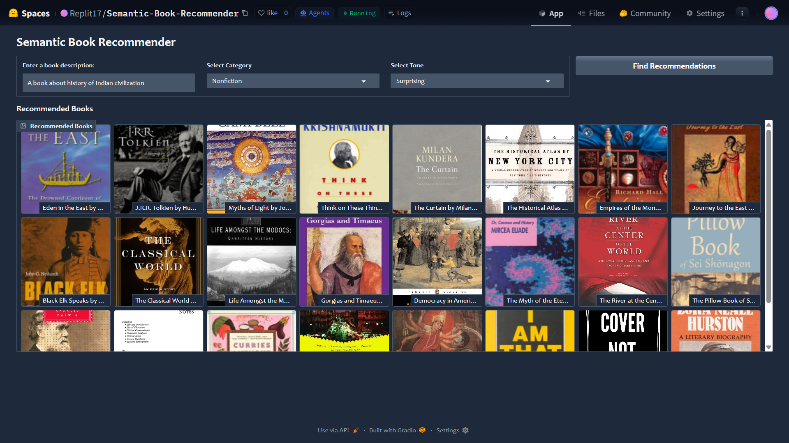
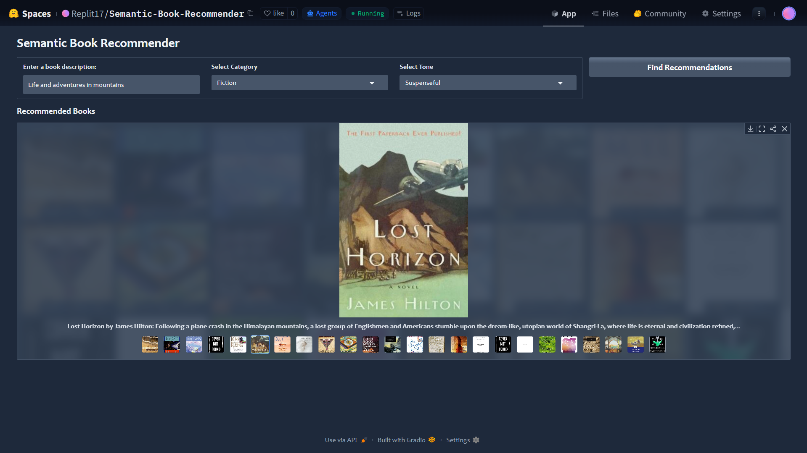

## 📌**Overview:**
The LLM Semantic Book Recommender is a machine learning-powered system that leverages Large Language Models (LLMs) and vector search to provide personalized book 
suggestions based on user input (description). By analyzing book descriptions, the system finds similar books based on semantic meaning and emotional tone.

## ✨ **Features:**
1. Semantic Search:- Find books based on content similarity using HuggingFace embeddings.
2. Emotion-Based Filtering:- Select books based on emotional tones like happy, angry, sad, suspenseful, etc.
3. Interactive UI:- A Gradio-based web dashboard for seamless user experience.
4. Fast Recommendations:- Efficient vector search using ChromaDB.
5. Text Classification:- Extracts sentiment and emotion from book descriptions.

## 🛠️ **Tech Stack:**
1. NLP & Machine Learning:- sentence-transformers, torch, transformers
2. Data Processing:- pandas, numpy
3. Vector Search:- chromadb, langchain
4. Web App UI:- gradio
5. Visualization:- matplotlib, seaborn

## 🏗 **Working:**
1. Text Embedding: Converts book descriptions into high-dimensional vectors using HuggingFaceEmbeddings.
2. Vector Search: Stores & retrieves embeddings using ChromaDB.
3. Filtering: Sorts recommendations based on category & emotional tone.
4. Interactive UI: Users input book descriptions & receive recommendations instantly.

## 🚀 **Live Demo:**
https://huggingface.co/spaces/Replit17/Semantic-Book-Recommender

## 📸 **Screenshots:**
### 🏠 Image 1

### 🏠 Image 2

## 🤝 **Contributing:**
Contributions are welcome! Feel free to fork the repository and submit a pull request.

## 📬 **Contact:**
Krishnathombare43@gmail.com

⭐**~ If you found this project useful, consider starring the repository!**
