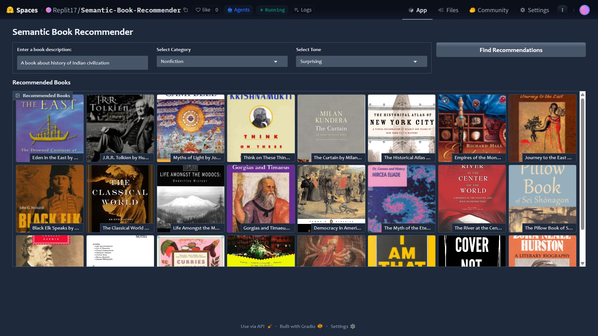
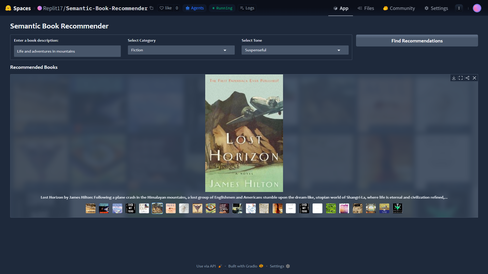

## 📌**Overview:**
The LLM Semantic Book Recommender is an AI-powered recommendation system that uses Large Language Models (LLMs) and vector embeddings to provide personalized book recommendations. It analyzes the semantic meaning and emotional tone of user input and book descriptions, then performs vector similarity search to identify books that best match the user's interests.

## ✨ **Features:**
1. Semantic Search:- Find books based on content similarity using HuggingFace embeddings.
2. Emotion Based Filtering:- Select books based on emotional tones like happy, surprising, angry, suspenseful and sad.
3. Interactive UI:- A Gradio-based web dashboard for seamless user experience.
4. Fast Recommendations:- Efficient vector search using ChromaDB.
5. Text Classification:- Extracts sentiment and emotion from book descriptions.

## 🛠️ **Tech Stack:**
1. NLP & Machine Learning:- sentence-transformers, torch, transformers
2. Data Processing:- pandas, numpy
3. Vector Search:- chromadb, langchain
4. Web App UI:- gradio
5. Visualization:- matplotlib, seaborn

## 🏗 **Working:**
1. Text Embedding:- Converts book descriptions into high-dimensional vectors using HuggingFaceEmbeddings.
2. Vector Search:- Stores & retrieves embeddings using ChromaDB.
3. Filtering:- Sorts recommendations based on category & emotional tone.
4. Interactive UI:- Users input book descriptions & receive recommendations instantly.

## 🚀 **Live Demo:**
https://huggingface.co/spaces/Replit17/Semantic-Book-Recommender

## 📸 **Screenshots:**
### 🏠 Image 1

### 🏠 Image 2

## 🤝 **Contributing:**
Contributions are welcome! Feel free to fork the repository and submit a pull request.

## 📬 **Contact:**
Krishnathombare43@gmail.com

⭐**~ If you found this project useful, consider starring the repository!**
